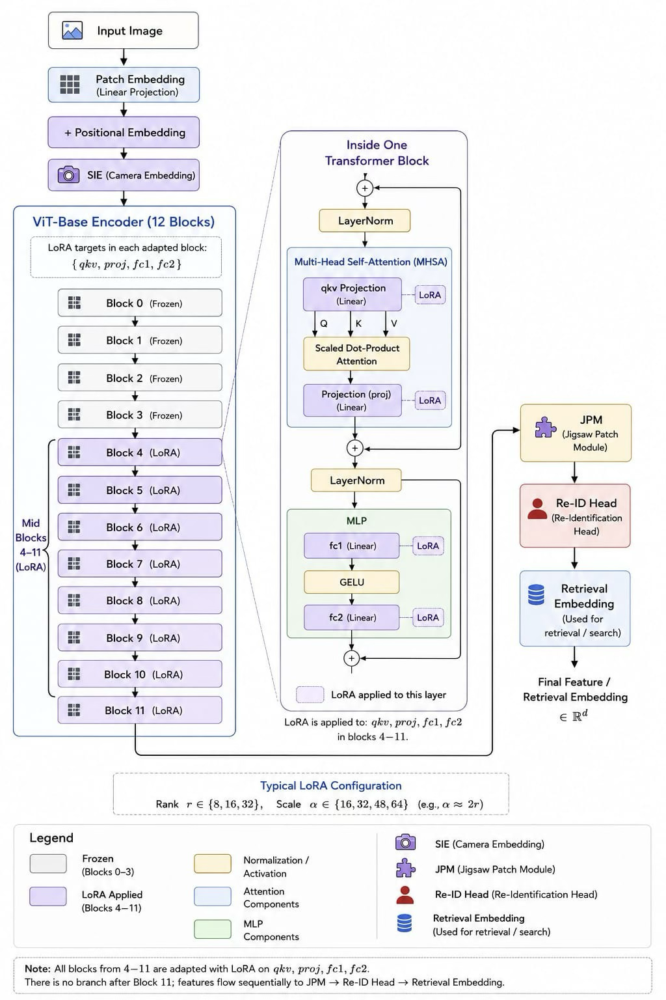

# LoRA on TransReID — Parameter-Efficient Fine-Tuning of a ViT Re-ID Backbone

This repository is a research fork of the official [**TransReID**](https://github.com/damo-cv/TransReID) codebase, extended with a **Low-Rank Adaptation (LoRA)** parameter-efficient fine-tuning (PEFT) layer for the ViT-Base backbone. It contains the LoRA experimental phase of our study:

> **Efficient Person Re-Identification via LoRA and SSF: A Comparative PEFT Study on ViT Backbone in TransReID**
> Huzaifa Naseer, Tameema Rehman, Anas Ashfaq, Farrukh Hasan Syed
> *Department of Computer Science, FAST-NUCES, Karachi, Pakistan*

Full paper resources and the companion SSF experiments: <https://github.com/Huzaifa9559/PEFT-on-Transreid.git>

## Pipeline

LoRA adapters are injected into the linear projections (`qkv`, `proj`, `fc1`, `fc2`) of the ViT-Base transformer blocks. The rest of the TransReID pipeline — patch embedding, positional embedding, SIE, JPM, and the Re-ID head — is left intact; the backbone is frozen and only the adapters and the head are trained. The figure below shows the `4–11` depth-placement regime (blocks 0–3 frozen, blocks 4–11 adapted).



---

## 1. Motivation

Full fine-tuning of ViT-based Re-ID models such as TransReID is expensive in memory and compute, and every new camera domain requires storing a full copy of the backbone. PEFT addresses this by **freezing the pretrained backbone** and training only a small set of task-specific parameters.

This repository asks a concrete question on a real Re-ID testbed: **how far can LoRA recover full-fine-tuning accuracy on TransReID / Market-1501, and at what memory cost?** We keep the entire TransReID training recipe fixed and vary only the LoRA design axes — depth placement, rank `r`, scaling `α`, and module targets — so that every accuracy/memory difference is attributable to the PEFT configuration alone.

---

## 2. What This Fork Changes

All modifications are additive; the TransReID architecture (SIE, JPM, Re-ID head) and the Market-1501 evaluation protocol are **unchanged**. LoRA is injected into the transformer-block linear layers only.

| Area | File(s) added / modified | Purpose |
|------|--------------------------|---------|
| **LoRA module** | `reid/peft/lora.py` | `LoRALinear` wrapper, ViT injection, block filtering, trainable-parameter masking, adapter save/load, eval-time merge |
| **Model wiring** | `model/make_model.py` | Injects LoRA into `model.base` after backbone build; freezes backbone; unfreezes adapters + Re-ID head |
| **Config schema** | `config/defaults.py` | New `_C.LORA` config node (`ENABLED`, `R`, `ALPHA`, `DROPOUT`, `TARGETS`, `BLOCKS`, `TRAIN_HEAD`, `MERGE_AT_EVAL`, `BIAS`, `SAVE_ADAPTER_ONLY`) |
| **Checkpointing** | `processor/processor.py` | Adapter-only checkpoint saving (stores just the LoRA tensors, not the full backbone) |
| **Experiment configs** | `configs/Market/vit_transreid_stride_lora*.yml` | Ready-to-run LoRA sweep configurations |
| **Verification** | `test_lora_blocks.py` | Sanity-checks that LoRA lands only on the intended blocks and reports the trainable-parameter ratio |
| **Data subsetting** | `make_market1501_subset.py` | Builds reduced Market-1501 splits for fast configuration sweeps |

### How LoRA is applied

For a frozen linear layer `W`, LoRA learns a low-rank update:

```
W' = W + (α / r) · B · A ,   A ∈ ℝ^{r×k},  B ∈ ℝ^{d×r}
```

Only `A`, `B` (and, optionally, a LoRA bias) are trainable. Adapters are attached to the four parameter-heavy projections inside each adapted transformer block:

- `qkv` and `proj` — the MHSA cross-token routing
- `fc1` and `fc2` — the FFN per-token non-linear transform

The backbone weights, patch embedding, SIE, and JPM parameters stay frozen; the LoRA adapters, LayerNorm parameters, and the Re-ID head remain trainable.

---

## 3. Configuration Space

The LoRA sweep is driven entirely from YAML (`configs/Market/`). The axes explored in the paper:

| Axis | Values | Notes |
|------|--------|-------|
| **Depth (blocks)** | `0–11`, `4–11`, `6–11` | Set via `LORA.BLOCKS`; empty = all 12 blocks |
| **Rank `r`** | `8, 16, 32` | `LORA.R` |
| **Scaling `α`** | `16, 32, 48, 64` | `LORA.ALPHA`; recipe favors `α ≈ 2r` |
| **Module targets** | `{qkv, proj, fc1, fc2}` (default) or `{qkv, proj}` (attention-only ablation) | `LORA.TARGETS` |

Reference baseline: **full fine-tuning** (`LORA.ENABLED: False`), all TransReID weights trainable.

---

## 4. Key Results (Market-1501)

All runs: single NVIDIA RTX 4000 Ada (20 GB), 60 epochs, AdamW, cosine decay, batch fit within 20 GB, seeds fixed. `ΔmAP` is the absolute gap from the full-fine-tuning baseline. `*` marks the attention-only ablation.

| Blocks | r | α | mAP | Rank-1 | Rank-5 | Rank-10 | GPU (GB) | ΔmAP |
|:------:|:-:|:-:|:---:|:------:|:------:|:-------:|:--------:|:----:|
| **Baseline (Full FT)** | — | — | **88.0** | **94.4** | 98.2 | 99.0 | 11.5 | — |
| 0–11 | 8 | 16 | 85.8 | 93.5 | 98.0 | 98.9 | 11.4 | −2.2 |
| 0–11 | 16 | 16 | 75.5 | 88.5 | 95.8 | 97.4 | 10.6 | −12.5 |
| 0–11 | 16 | 32 | 74.0 | 87.6 | 94.9 | 97.2 | 11.0 | −14.0 |
| 4–11 | 8 | 16 | 80.5 | 91.5 | 96.9 | 98.2 | 8.03 | −7.5 |
| 4–11 | 16 | 32 | 82.1 | 92.4 | 97.2 | 98.5 | 8.34 | −5.9 |
| 4–11 | 16 | 48 | 82.7 | 92.5 | 97.5 | 98.6 | 8.01 | −5.3 |
| **4–11** | **32** | **64** | **83.2** | **92.8** | 97.8 | 98.5 | **7.84** | **−4.8** |
| 6–11 | 8 | 16 | 74.8 | 88.2 | 96.0 | 97.7 | 7.60 | −13.2 |
| 6–11 | 16 | 16 | 75.3 | 89.2 | 96.1 | 97.5 | 6.90 | −12.7 |
| 6–11 | 16 | 32 | 77.4 | 90.1 | 96.5 | 97.9 | 7.59 | −10.6 |
| 6–11 | 16* | 32 | 74.6 | 88.5 | 96.3 | 97.7 | 7.06 | −13.4 |
| 6–11 | 16 | 64 | 63.4 | 81.9 | 93.3 | 95.8 | 7.00 | −24.6 |
| 6–11 | 32 | 64 | 78.9 | 90.6 | 96.8 | 98.4 | 7.06 | −9.1 |

### Takeaways

- **Depth placement dominates.** `4–11` is the best accuracy–memory compromise: **mAP 83.2 % (within ~5 points of baseline) at 7.84 GB — a ~30 % VRAM reduction.**
- **Memory is driven by activations, not parameters.** `0–11` retains adapters (and thus activations) at full depth, so it barely saves memory; restricting to `4–11`/`6–11` frees early-block activations and drops VRAM to ~7–8 GB.
- **Keep `α ≈ 2r`.** Aggressive scaling destabilizes training — `(6–11, r=16, α=64)` collapses to mAP 63.4 %.
- **MLP adaptation matters.** Excluding `fc1/fc2` (attention-only `*`) costs several points of mAP for negligible memory savings.

### Companion SSF results (from the paper)

The paper also studies **SSF** (per-channel scale-and-shift) as a structurally different PEFT baseline (implemented in the companion repo). SSF reaches a very compact ~2.83–2.87 % trainable-parameter footprint (best mAP ≈ 79.9 % at full `0–11` coverage) but shows a larger accuracy gap than LoRA and relies more heavily on full-depth coverage. **LoRA and SSF are complementary:** LoRA when accuracy recovery is paramount, SSF when parameter budget / storage dominates.

### Practical guideline

| Constraint | Recommended config | Expected outcome |
|------------|--------------------|------------------|
| Maximize accuracy | Full FT, or `0–11` LoRA `r=8` | mAP ≈ 85–88 %, 11–11.5 GB |
| ~30 % VRAM savings | `4–11` LoRA, `r=16–32`, `α≈2r` | mAP ≈ 82–83 %, 7.8–8.3 GB |
| Tight GPU (~7 GB) | `6–11` LoRA, `r=16–32`, `α≈2r` | mAP ≈ 75–79 %, 7–7.6 GB |
| Avoid instability | keep `α≈2r`; avoid `r=16, α=64` | smooth accuracy-vs-rank curve |

---

## 5. Setup

### Installation

```bash
pip install -r requirements.txt
# torch / torchvision / timm / yacs / opencv-python
# GPU used in the paper: NVIDIA RTX 4000 Ada (20 GB). torch.cuda.amp requires PyTorch >= 1.6.
```

See [`CUDA_SETUP_GUIDE.md`](CUDA_SETUP_GUIDE.md) for a step-by-step CUDA/PyTorch setup and `check_cuda.py` to verify the GPU is visible.

### Prepare Market-1501

```bash
mkdir data
```

Download [Market-1501](https://drive.google.com/file/d/0B8-rUzbwVRk0c054eEozWG9COHM/view), unzip, and place it as:

```
data
└── market1501
    └── images ..
```

For fast configuration sweeps you can build a reduced split:

```bash
python make_market1501_subset.py --help
```

### Pretrained ViT backbone

Download the ImageNet-pretrained [ViT-Base](https://github.com/rwightman/pytorch-image-models/releases/download/v0.1-vitjx/jx_vit_base_p16_224-80ecf9dd.pth) and point `MODEL.PRETRAIN_PATH` in the config to it.

---

## 6. Running LoRA Experiments

Every LoRA run is a single config file. Edit `LORA.BLOCKS`, `LORA.R`, `LORA.ALPHA`, and `LORA.TARGETS` to move around the configuration space, and update `DATASETS.ROOT_DIR` / `MODEL.PRETRAIN_PATH` to your paths.

```bash
# LoRA on all blocks (0–11), r=8, α=16
python train.py --config_file configs/Market/vit_transreid_stride_lora.yml MODEL.DEVICE_ID "('0')"

# Best compromise: LoRA on blocks 4–11, r=32, α=64
python train.py --config_file configs/Market/vit_transreid_stride_lora_blocks_6_11.yml \
    MODEL.DEVICE_ID "('0')" LORA.BLOCKS "[4,5,6,7,8,9,10,11]" LORA.R 32 LORA.ALPHA 64
```

Any LoRA field can be overridden from the command line, e.g. `LORA.TARGETS "['qkv','proj']"` for the attention-only ablation.

### Full fine-tuning baseline

```bash
python train.py --config_file configs/Market/vit_transreid_stride.yml MODEL.DEVICE_ID "('0')"
```

### Evaluation

Adapter-only checkpoints are saved when `LORA.SAVE_ADAPTER_ONLY: True`; they are loaded automatically on top of the frozen backbone at test time.

```bash
python test.py --config_file configs/Market/vit_transreid_stride_lora.yml \
    MODEL.DEVICE_ID "('0')" TEST.WEIGHT '../logs/market_vit_transreid_stride_lora/transformer_60.pth'
```

### Verify LoRA placement

```bash
python test_lora_blocks.py
# prints which blocks received adapters + the trainable-parameter percentage
```

---

## 7. LoRA Config Reference

```yaml
LORA:
  ENABLED: True                          # master switch
  R: 32                                  # rank r
  ALPHA: 64                              # scaling α (aim for α ≈ 2r)
  DROPOUT: 0.05
  TARGETS: ["qkv", "proj", "fc1", "fc2"] # ["qkv","proj"] = attention-only ablation
  BLOCKS: [4, 5, 6, 7, 8, 9, 10, 11]     # empty/omit = all 12 blocks
  TRAIN_HEAD: True                       # keep the Re-ID head trainable
  MERGE_AT_EVAL: False                   # fold adapters into base weights at eval
  BIAS: "none"                           # "none" | "lora" | "all"
  SAVE_ADAPTER_ONLY: True                # checkpoint stores only adapter tensors
```

---

## 8. Citation

If you use this repository or its findings, please cite our study and the original TransReID:

```bibtex
@article{naseer2025peft,
  title   = {Efficient Person Re-Identification via LoRA and SSF:
             A Comparative PEFT Study on ViT Backbone in TransReID},
  author  = {Naseer, Huzaifa and Rehman, Tameema and Ashfaq, Anas and Syed, Farrukh Hasan},
  year    = {2025}
}

@InProceedings{He_2021_ICCV,
  author    = {He, Shuting and Luo, Hao and Wang, Pichao and Wang, Fan and Li, Hao and Jiang, Wei},
  title     = {TransReID: Transformer-Based Object Re-Identification},
  booktitle = {Proceedings of the IEEE/CVF International Conference on Computer Vision (ICCV)},
  year      = {2021},
  pages     = {15013-15022}
}
```

---

## 9. Acknowledgement

Built on top of [TransReID](https://github.com/damo-cv/TransReID), which itself derives from [reid-strong-baseline](https://github.com/michuanhaohao/reid-strong-baseline) and [pytorch-image-models](https://github.com/rwightman/pytorch-image-models). The LoRA formulation follows Hu et al. (ICLR 2022), and the companion SSF baseline follows Lian et al. (NeurIPS 2022).
